# Player positions and the 4×4 Q matrix

I examine twelve representative soccer states. Each is identified by its
**state, five numbers `(x0, y0, x1, y1, b)`**: player 0's cell `(x0, y0)`,
player 1's cell `(x1, y1)`, and `b` (which player currently has the ball,
`0` or `1`). That five-number state is not part of the Q matrix -- it just
names *which* stage game is being shown; the Q matrix itself is the `4x4`
table of payoffs indexed by the two players' *actions* (`U D L R` each), not
by coordinates.

For each state, the **left panel** shows the physical player configuration
and every action either player actually takes in equilibrium, drawn as
probability arrows (thick = likely, thin = unlikely, no arrow at all = zero
probability). The **right panel** shows the complete **`4x4` stage-game Q
matrix** -- the payoff table `Q(s, a0, a1)` at that one state, not the value
function `V(s)` -- redrawn as a node-and-arrow graph, one node per cell, an
arrow toward whichever cell either player would rather deviate to. Always
the full grid, never reduced. The goal is not simply to show *where* mixing
happens on the board, but **what the players are actually doing when it
does**.

A player's **support** is the set of actions it assigns positive probability
in an equilibrium strategy -- support `(2,2)` means the carrier mixes over 2
actions and the defender mixes over 2 actions.

**Canonical support shapes.** Across the whole project there are exactly
four of them, once every stage game is reoriented so rows are always the
carrier's actions:

| Carrier support | Defender support | Shape | States |
|:---:|:---:|:---:|---:|
| 2 actions | 2 actions | `(2,2)` | 68 |
| 3 actions | 3 actions | `(3,3)` | 4 |
| 2 actions | 1 action | `(2,1)` | 14 |
| 3 actions | 2 actions | `(3,2)` | 8 |
| | | **total** | **94** |

**The defender's support is never larger than the carrier's**, in any of the
94 no-pure-saddle states on the canonical board. The bigger finding underneath those
four rows: **94 no-pure-saddle states are not 94 different phenomena -- they are four
repeated shapes, recurring all over the board.**

## Three kinds of fractional output, labelled below on every case

A reported fractional split is not always a number the game forces. Every
case below is labelled with exactly one of these ([degeneracy.md](degeneracy.md)
has the full breakdown, all 94 states):

- **Forced mixed equilibrium** -- neither side has an unweighted action tied
  with its reported support's value. The split shown is the whole
  indifference class; no freedom is left over. (64 of the 94 no-pure-saddle
  states.)
- **Degenerate equilibrium face** -- a side's reported support already has
  two or more actions, and a further, unweighted action ties them exactly.
  The LP found one vertex of a larger polytope of equally-valid equilibria,
  not a uniquely forced ratio. (16 of 94.)
- **Pure-tied / fractional LP output** -- a side's reported support is a
  *single* action (nominally "pure"), but an unweighted action ties it
  exactly -- that "pure" reply is exactly as arbitrary as a printed
  fractional split, it just isn't drawn as a percentage. (14 of 94, always
  the defender.)

Case 7 shows one of the 64 repeats directly (Case 2's exact shape, elsewhere
on the board, mirrored). This page shows one example of each of the four
canonical support shapes, plus every distinct *mechanism* studied in the
project that can force a mix: a stochastic move order, this project's own
tackle rule, a dense reward with zero transition noise, and movement slip on
a goal shape that is otherwise always pure. Every one of the twelve gets its
own full-size board-and-matrix figure below -- no combined overview image,
so nothing here is ever cropped by a page break.

## Reading the board and the Q matrix

**The board (left).** Each player is a filled circle; the ball sits on
whoever carries it. An arrow points from a player toward a cell it might
move to, and its **thickness and opacity are the equilibrium probability**
of that action -- a bold arrow is very likely, a thin one is unlikely, and
an action with (numerically) zero probability draws no arrow at all. A pure
policy is one bold arrow and nothing else; a mixed policy fans out into two
or three arrows of different weights. Percentages are labelled next to every
arrow that isn't at 100%.

**The Q matrix (right).** Each node is one cell of the complete `4x4` stage
matrix (`row = the carrier's action`, `col = the defender's action`, always
reoriented so the printed payoff is the carrier's, regardless of which
player id actually carries -- see `_oriented_matrix` in
`scripts/positions.py`). A blue arrow points from a cell to the cell in the
same column with the higher payoff -- the carrier's own reason to switch
rows. A green arrow points from a cell to the cell in the same row with the
*lower* payoff -- the defender's reason to switch columns, since the
defender minimises. Every case shows the complete grid, all 16 cells, so the
shapes are directly comparable across cases. This is the mathematical
justification *for* what the board already shows: it is why the players'
support is exactly what it is.

- **A pure state has exactly one node with no outgoing arrow.** That cell is
  the saddle; everything else eventually points to it.
- **A mixed state has arrows everywhere.** Every node points somewhere, so
  they chase each other around a closed best-response cycle: no pure action
  pair is stable, which is exactly why the board shows more than one arrow.

**A wall clamp is a hold, not a move.** A few of the states below have a
player already against an edge of the board -- attempting to move further
that way (`U` at the top row, `D` at the bottom, `L` at the left column, `R`
at the right) does not move the player at all; it silently returns the same
cell. Where the equilibrium puts real weight on one of these no-ops, the
board figure draws it as a dashed **hold** ring around the player (the same
treatment as an explicit `STAND` action), not a directional arrow -- an
arrow pointing into a wall would show movement that never happens. Cases 4,
5, 6, 8, 10 and 11 below each have at least one player pinned this way;
each is called out explicitly where it matters.

**A third piece, below the board and the Q matrix: the successor-state
coordinates.** Every case also gets a `4x4` table, same orientation as the Q
matrix, whose *cells* are the actual `(x0, y0, x1, y1, b)` state reached by
each joint action -- what `game.transitions()` returns, not what the payoff
is. Where the transition is stochastic (random move order, or the tackle
rule), a cell lists both possible successors and their probabilities. This
is the direct answer to "where do the numbers in the Q matrix actually come
from": each payoff is the expected value over exactly these successor
states.

## Five representative cases

For a focused read: the typical two-action mix, the cleanest indifference
example, a genuine three-action mix, the sharpest LP-degeneracy example, and
a case where a completely different mechanism (the reward, not the
transition) forces the mix. All twelve cases, these five included, follow in
full below in numbered order.

## Case 2 — `(0, 1, 1, 1, 0)`: the primary example -- the typical mix

**This is the case to lead with.** Gap `0.0136`. The carrier mixes
`U 63.5% / D 36.5%`; the defender answers `U 36.5% / R 63.5%`. This is not
one strange state among many -- it is the dominant pattern in the entire
mixed-state set: **90 of the 94 no-pure-saddle states on the canonical board** cross
a vertical pair exactly like this one, the carrier deciding which goal row
to attack and the defender guessing which one. Everything that follows is
either this same shape recurring (Case 7), or a genuinely different shape
worth contrasting against it (Cases 3, 4, 5, 9, 10).

**Type:** forced mixed equilibrium -- the reported 63.5%/36.5% split is the
whole indifference class, not one point on a larger face.

**Support:** carrier `{U, D}` (63.5% / 36.5%) · defender `{U, R}`
(36.5% / 63.5%).

**Why indifferent:** Carrier `E[U]`=`E[D]`=+0.094, strictly above `E[L]`=+0.091 and `E[R]`=−0.015. Defender `E[U]`=`E[R]`=+0.094, strictly below `E[L]`=+0.212 and `E[D]`=+0.332.

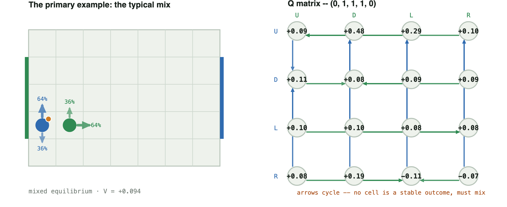

```
        U        D        L        R
  U   0.086    0.478    0.286    0.099
  D   0.109    0.076    0.085    0.086
  L   0.103    0.103    0.085    0.084
  R   0.082    0.187   -0.108   -0.071
```

**Successor states, by joint action** -- same orientation as the Q matrix above (`carrier` row, `defender` column), each cell the resulting `(x0, y0, x1, y1, b)`. Two lines in a cell means the outcome depends on who moves first (each 50%).

| carrier \ defender | U | D | L | R |
|---|---|---|---|---|
| **U** | (0,2,1,2,0) | (0,2,1,0,0) | 50%: (0,2,0,1,0)<br>50%: (0,2,1,1,0) | (0,2,2,1,0) |
| **D** | (0,0,1,2,0) | (0,0,1,0,0) | 50%: (0,0,0,1,0)<br>50%: (0,0,1,1,0) | (0,0,2,1,0) |
| **L** | (0,1,1,2,0) | (0,1,1,0,0) | (0,1,1,1,0) | (0,1,2,1,0) |
| **R** | 50%: (0,1,1,2,1)<br>50%: (1,1,1,2,0) | 50%: (0,1,1,0,1)<br>50%: (1,1,1,0,0) | 50%: (0,1,1,1,0)<br>50%: (0,1,1,1,1) | 50%: (0,1,2,1,1)<br>50%: (1,1,2,1,0) |

## Case 3 — `(1, 1, 1, 0, 1)`: a clean L/R indifference example

Placed directly after the primary example on purpose: this is the cleanest
demonstration of the intuition Case 2 only implies --

> "when we move right and when we move left, there's an equal chance of me
> winning. That's why I am indifferent between the two."

Gap `0.0445`. The carrier's entire live option set is **exactly `{L, R}`**
-- no vertical option survives at all, which is what makes this state (rather
than Case 4, which crosses `U/L`) the cleanest match to that description:
two actions genuinely equally good against the defender's own mix. This is
the *rarer* shape overall: only 4 of 94 no-pure-saddle states cross a purely
horizontal pair instead of a vertical one.

**Type:** forced mixed equilibrium -- both sides' splits are the whole
indifference class.

**Support:** carrier `{L, R}` (7.7% / 92.3%) · defender `{D, L}`
(18% / 82%).

**Why indifferent:** Carrier `E[L]`=`E[R]`=+0.206, strictly above `E[D]`=+0.162 and `E[U]`=+0.050. Defender `E[D]`=`E[L]`=+0.206, strictly below `E[R]`=+0.216 and `E[U]`=+0.257.

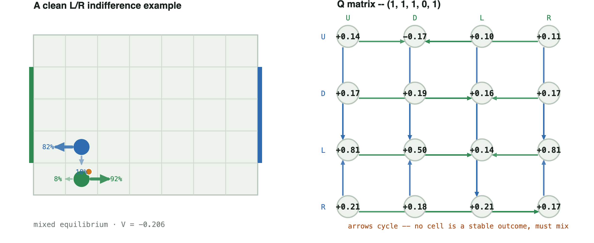

```
        U        D        L        R
  U   0.139   -0.173    0.099    0.110
  D   0.171    0.185    0.157    0.171
  L   0.810    0.500    0.141    0.810
  R   0.211    0.181    0.211    0.167
```

**Successor states, by joint action** -- same orientation as the Q matrix above (`carrier` row, `defender` column), each cell the resulting `(x0, y0, x1, y1, b)`. Two lines in a cell means the outcome depends on who moves first (each 50%).

| carrier \ defender | U | D | L | R |
|---|---|---|---|---|
| **U** | 50%: (1,2,1,1,1)<br>50%: (1,2,1,0,0) | 50%: (1,1,1,0,0)<br>50%: (1,1,1,0,1) | 50%: (0,1,1,1,1)<br>50%: (0,1,1,0,0) | 50%: (2,1,1,1,1)<br>50%: (2,1,1,0,0) |
| **D** | (1,2,1,0,1) | (1,1,1,0,1) | (0,1,1,0,1) | (2,1,1,0,1) |
| **L** | (1,2,0,0,1) | 50%: (1,1,0,0,1)<br>50%: (1,0,0,0,1) | (0,1,0,0,1) | (2,1,0,0,1) |
| **R** | (1,2,2,0,1) | 50%: (1,1,2,0,1)<br>50%: (1,0,2,0,1) | (0,1,2,0,1) | (2,1,2,0,1) |

## Case 5 — `(0, 0, 2, 0, 0)`: a genuine 3-action mix

Six cells from goal, as far as this board allows, with the defender close
enough to threaten three different rows at once: no single row is safely
better than the other two, so three actions are simultaneously undominated
on both sides. This is one of only **4 states on the whole canonical board**
with support shape `(3,3)` -- mixing is not always a 50/50 split between two
actions. (Entropy 1.109 bits, the richest mix on this page, if a single
summary number is wanted -- but the three-way split itself is the point.)

**Both players are pinned against an edge here**, so read the raw action
letters with that in mind: the carrier sits at `(0, 0)`, so `L` is a wall
no-op -- it clamps straight back to `(0, 0)`, physically identical to `D` --
which is why the board figure draws that 54.7% as a dashed **hold** ring,
not a leftward arrow. The three genuinely distinct carrier choices are
*attack up* (`U`, 43.3%), *hold ground* (`D`/`L` combined, 54.7%), and
*sneak right* (`R`, 1.9%) -- still a real three-way mix, just not the
three-arrows picture the raw letters would suggest. The defender at `(2, 0)`
has the same issue in miniature: `D` is its own wall no-op (5.9%, folded
into its own hold ring), alongside real moves `U` (91.9%) and `L` (2.3%).

**Type:** degenerate equilibrium face (carrier) -- see "why indifferent"
below: a fourth, unweighted carrier action ties the reported three-way split
exactly, so the printed 43.3%/0%/54.7%/1.9% is one point on a larger face,
not a forced ratio. Here that tie is not a coincidence of the LP: `D` and
`L` are the *same physical action* from `(0, 0)`, so `E[D]`=`E[L]` is a
mechanical certainty, not a numerical accident -- the LP's split of that
54.7% between the labels `D` and `L` is arbitrary, but the 43.3%/54.7%/1.9%
split between *attack*/*hold*/*sneak* is not. The defender's own reported
split is a genuine forced mix.

**Support:** carrier `{U, L, R}` (43.3% / 54.7% / 1.9%, `L` a wall hold) ·
defender `{U, D, L}` (91.9% / 5.9% / 2.3%, `D` a wall hold).

**Why indifferent:** Carrier `E[U]`=`E[L]`=`E[R]`=+0.0848 (the three actions weighted) -- and `E[D]`=+0.0848 too: **all four actions tie exactly**, and `E[D]`=`E[L]` here is guaranteed before any LP runs, since `D` and `L` are the same wall-clamped no-op from `(0, 0)`. The printed 43.3%/0%/54.7%/1.9% split is one point on a whole face of equally-good carrier mixes, not a uniquely forced ratio. Defender `E[U]`=`E[D]`=`E[L]`=+0.0848, below `E[R]`=+0.097.

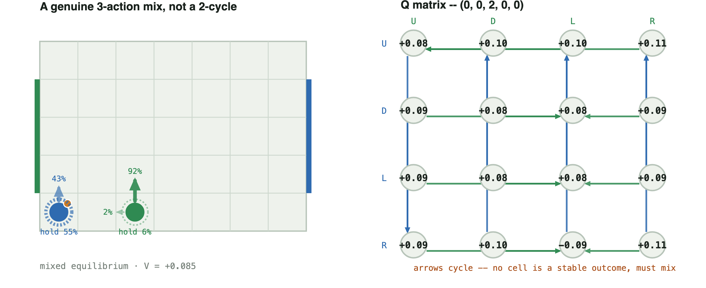

```
        U        D        L        R
  U   0.084    0.095    0.103    0.110
  D   0.086    0.076    0.076    0.086
  L   0.086    0.076    0.076    0.086
  R   0.088    0.095   -0.088    0.110
```

**Successor states, by joint action** -- same orientation as the Q matrix above (`carrier` row, `defender` column), each cell the resulting `(x0, y0, x1, y1, b)`. Two lines in a cell means the outcome depends on who moves first (each 50%).

| carrier \ defender | U | D | L | R |
|---|---|---|---|---|
| **U** | (0,1,2,1,0) | (0,1,2,0,0) | (0,1,1,0,0) | (0,1,3,0,0) |
| **D** | (0,0,2,1,0) | (0,0,2,0,0) | (0,0,1,0,0) | (0,0,3,0,0) |
| **L** | (0,0,2,1,0) | (0,0,2,0,0) | (0,0,1,0,0) | (0,0,3,0,0) |
| **R** | (1,0,2,1,0) | (1,0,2,0,0) | 50%: (1,0,2,0,0)<br>50%: (0,0,1,0,1) | (1,0,3,0,0) |

## Case 9 — `(0, 2, 1, 2, 0)`: the asymmetric mix -- the sharpest LP-degeneracy example

Support `(2, 1)` -- gap `0.0095`. The odd one out: the carrier's equilibrium
still mixes two actions (`U 2.6% / D 97.4%`), but the **defender's**
equilibrium is a *single fixed move* (`R`, 100%). Every other case on this
page is a symmetric duel -- both players genuinely guessing. Here only one
side is.

**Type:** pure-tied / fractional LP output (defender). The defender's
official policy is printed pure `R` (100%), but `D` ties it exactly -- the
defender's choice of `R` over `D` is exactly as arbitrary as a printed
fractional split, it just isn't drawn as a percentage because the LP put
all the weight on one action. This is the sharpest example on this page
that **a fractional LP output is not automatically a strategically required
mixed strategy.**

**Support:** carrier `{U, D}` (2.6% / 97.4%) · defender `{R}` (100%).

**Why indifferent:** Carrier `E[U]`=`E[D]`=+0.095, above `E[L]`=+0.093 and `E[R]`=−0.072 (worked out fully below). The defender's official policy is pure `R` (100%), but `E[R]`=+0.095 and `E[D]`=+0.095 tie **too**: the defender's own choice of `R` over `D` is exactly as arbitrary as the carrier's `U`/`D` split, it just isn't printed as a percentage because the solver put all the weight on one side.

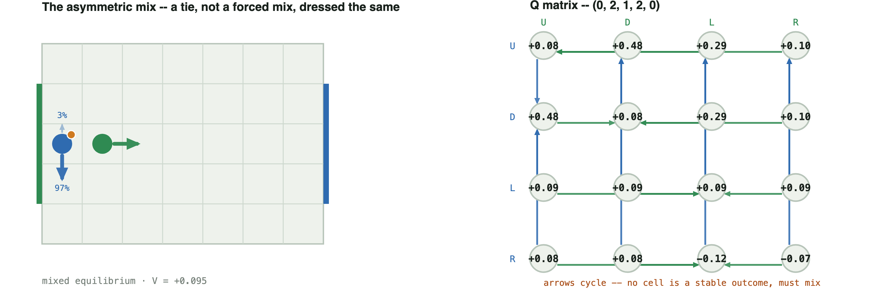

```
        U        D        L        R
  U   0.085    0.478    0.291    0.095
  D   0.478    0.085    0.291    0.095
  L   0.093    0.093    0.086    0.093
  R   0.082    0.082   -0.122   -0.072
```

**Successor states, by joint action** -- same orientation as the Q matrix above (`carrier` row, `defender` column), each cell the resulting `(x0, y0, x1, y1, b)`. Two lines in a cell means the outcome depends on who moves first (each 50%).

| carrier \ defender | U | D | L | R |
|---|---|---|---|---|
| **U** | (0,3,1,3,0) | (0,3,1,1,0) | 50%: (0,3,0,2,0)<br>50%: (0,3,1,2,0) | (0,3,2,2,0) |
| **D** | (0,1,1,3,0) | (0,1,1,1,0) | 50%: (0,1,0,2,0)<br>50%: (0,1,1,2,0) | (0,1,2,2,0) |
| **L** | (0,2,1,3,0) | (0,2,1,1,0) | (0,2,1,2,0) | (0,2,2,2,0) |
| **R** | 50%: (0,2,1,3,1)<br>50%: (1,2,1,3,0) | 50%: (0,2,1,1,1)<br>50%: (1,2,1,1,0) | 50%: (0,2,1,2,0)<br>50%: (0,2,1,2,1) | 50%: (0,2,2,2,1)<br>50%: (1,2,2,2,0) |

Why the carrier still needs two actions against a defender who never
varies: against the defender's pure `R`, column `R` reads `U 0.095, D 0.095,
L 0.093, R -0.072` -- **`U` and `D` are exactly tied**, both strictly better
than `L` or `R`. Nothing in the payoffs favours one over the other, so any
split of `U`/`D` is an equally valid best reply; the solver's LP reports one
particular split (`2.6% / 97.4%`), not a probability forced by the game the
way Case 3's `7.7% / 92.3%` is. `soccer_nash/certificate.py`'s `gap` field
still distinguishes the two: a tie is a **degenerate** saddle (row `L`'s pure
security value, `0.086`, sits within `0.0095` of the mixed value), while
Case 3's cycle has no pure security value anywhere near it.

## Case 11 — `(4, 4, 5, 4, 0)`, deterministic: mixing forced by reward alone, not transition

An advanced case, illustrating a fundamentally different mechanism from the
four above. Every case so far gets its coin flip from a stochastic
*transition* -- the random move order. This one has **no transition
stochasticity at all** (`move_order="deterministic"`): the mix comes
entirely from `scoring="territory"`, a dense per-step reward for the ball
in the opponent's final third, layered on top of the ordinary win/loss
score. Gap `0.0653` -- close to a fair coin (entropy 0.996 bits), forced
purely by coupling the reward to both players' actions. **Mixing does not
require stochastic transitions; it can come from the payoff structure
alone.** The defender sits at `(5, 4)`, the top edge, so its reported
majority action `U` (95.1%) is a wall no-op: it holds position 95.1% of the
time and slides left (`L`) the other 4.9%.

**Type:** forced mixed equilibrium -- the reward-coupling forces a genuine
indifference on both sides, the same as a transition-coupled matching-pennies
core.

**Support:** carrier `{D, R}` (53.8% / 46.2%, both real moves) · defender
`{hold, L}` (95.1% / 4.9%, printed as `U`/`L`).

**Why indifferent:** Carrier `E[D]`=`E[R]`=+0.129, above `E[U]`=+0.119 and `E[L]`=+0.090. Defender `E[U]`=`E[L]`=+0.129, below `E[D]`=+0.455 and `E[R]`=+0.473 -- `U` here is the defender holding at the top edge, tied with a real move left.

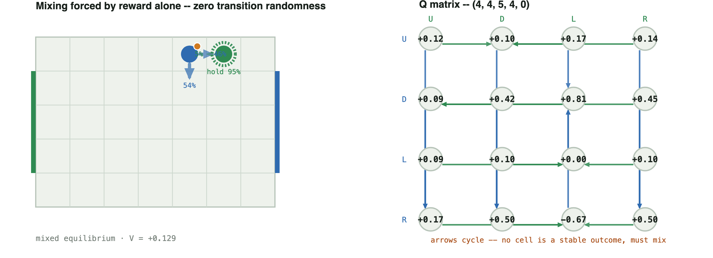

```
        U        D        L        R
  U   0.116    0.105    0.170    0.136
  D   0.094    0.415    0.815    0.450
  L   0.094    0.105    0.000    0.105
  R   0.170    0.500   -0.671    0.500
```

**Successor states, by joint action** -- same orientation as the Q matrix above (`carrier` row, `defender` column), each cell the resulting `(x0, y0, x1, y1, b)`. Two lines in a cell means the outcome depends on who moves first (each 50%).

| carrier \ defender | U | D | L | R |
|---|---|---|---|---|
| **U** | (4,4,5,4,0) | (4,4,5,3,0) | (4,4,5,4,1) | (4,4,6,4,0) |
| **D** | (4,3,5,4,0) | (4,3,5,3,0) | (4,3,4,4,0) | (4,3,6,4,0) |
| **L** | (3,4,5,4,0) | (3,4,5,3,0) | (3,4,4,4,0) | (3,4,6,4,0) |
| **R** | (4,4,5,4,1) | (5,4,5,3,0) | (5,4,4,4,1) | (5,4,6,4,0) |

## From worked cases to exploitability: pure vs. mixed, at these exact states

Everything above stays inside one stage game -- what the carrier and
defender do *at* a state. [tournament_deepdive.md](tournament_deepdive.md)
shows the whole-game consequence -- greedy collapses against a challenger,
minimax doesn't -- but at the level of the *tournament*, not any one of
these states. This table connects the two directly: at each state, force
the carrier to its single most likely ("greedy") action and let the
defender best-respond *within that one stage game*, then compare to the
actual Nash mixed value. Three rows (Cases 4, 6, 10) are detailed further
down in the complete set below; the other four are the lead cases above.

| case | greedy pure value vs. BR | Nash mixed value vs. BR | value of mixing |
|---|---:|---:|---:|
| Case 2 -- the primary example | +0.0856 | +0.0942 | +0.0086 |
| Case 3 -- L/R indifference | +0.1665 | +0.2056 | +0.0391 |
| Case 4 -- the corner duel (appendix) | +0.0763 | +0.0776 | +0.0012 |
| Case 5 -- 3-action mix | +0.0763 | +0.0848 | +0.0085 |
| Case 6 -- near-pure hedge (appendix) | +0.1665 | +0.1676 | +0.0011 |
| Case 9 -- the asymmetric mix | +0.0848 | +0.0951 | +0.0103 |
| Case 10 -- the three-lane mix (appendix) | +0.2471 | +0.2816 | +0.0345 |

**The value of mixing is never negative** -- exactly the theoretical
guarantee (an equilibrium mix is a best response to the opponent's best
response; nothing pure can beat that). It is also not uniform: Case 3's
clean L/R indifference is worth `+0.039`, fifteen times more than Case 6's
near-pure hedge (`+0.0011`, unsurprising -- a 97.5/2.5 hedge is *almost*
what the greedy action already does) or Case 4's corner duel (`+0.0012`,
the corner leaves little room to exploit either way). Case 3 and Case 10 --
the deepest gap of any case in this doc -- are also the two largest values
of mixing here: the states where the matrix punishes commitment hardest are
the same ones where committing costs the most.

## All twelve cases, in full

The five above are the ones to read first. What follows is the complete
set, `Case 1` through `Case 12` in order -- the same five again, in their
numbered place, plus the seven not covered above: a pure state for
contrast, the fourth and last canonical support shape, a hedge so shallow
that rounding it would misread the game, this project's own tackle rule
producing the same duel by a different mechanism, the exact mirror of
Case 2, a case worth discussing on its own (Case 9's twin structural
finding, the three-lane mix), and a single-cell goal forced to mix anyway
once movement noise is added -- each with its board, its node-and-arrow
graph, its exact `4x4` Q matrix, and its type label.

## Case 1 — `(4, 0, 5, 0, 0)`: a pure state, for contrast

Saddle at `U/U`. The carrier plays `U` always; the defender plays `U`
always; neither has any reason to deviate.

**Type:** pure equilibrium -- not one of the 94 no-pure-saddle states; shown
for contrast with everything else on this page.

**Support:** carrier `{U}` (100%) · defender `{U}` (100%).

**Why indifferent:** Carrier: `U`=+0.234 beats next-best `L`=+0.161 by 0.073; defender: `U`=+0.234 beats next-best `R`=+0.271 by 0.038. No tie on either side -- that gap, not a coin flip, is what makes this state pure.

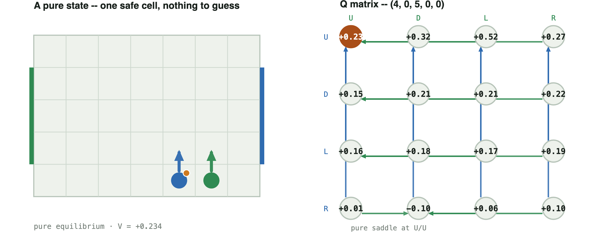

```
        U        D        L        R
  U   0.234    0.317    0.523    0.272
  D   0.151    0.211    0.211    0.222
  L   0.161    0.182    0.172    0.190
  R   0.012   -0.095    0.058    0.098
```

**Successor states, by joint action** -- same orientation as the Q matrix above (`carrier` row, `defender` column), each cell the resulting `(x0, y0, x1, y1, b)`. Two lines in a cell means the outcome depends on who moves first (each 50%).

| carrier \ defender | U | D | L | R |
|---|---|---|---|---|
| **U** | (4,1,5,1,0) | (4,1,5,0,0) | 50%: (4,1,4,0,0)<br>50%: (4,1,5,0,0) | (4,1,6,0,0) |
| **D** | (4,0,5,1,0) | (4,0,5,0,0) | (4,0,5,0,0) | (4,0,6,0,0) |
| **L** | (3,0,5,1,0) | (3,0,5,0,0) | 50%: (3,0,4,0,0)<br>50%: (3,0,5,0,0) | (3,0,6,0,0) |
| **R** | 50%: (4,0,5,1,1)<br>50%: (5,0,5,1,0) | (4,0,5,0,1) | 50%: (4,0,5,0,0)<br>50%: (4,0,5,0,1) | 50%: (4,0,6,0,1)<br>50%: (5,0,6,0,0) |

## Case 2 — `(0, 1, 1, 1, 0)`: the primary example -- the typical mix

**This is the case to lead with.** Gap `0.0136`. The carrier mixes
`U 63.5% / D 36.5%`; the defender answers `U 36.5% / R 63.5%`. This is not
one strange state among many -- it is the dominant pattern in the entire
mixed-state set: **90 of the 94 no-pure-saddle states on the canonical board** cross
a vertical pair exactly like this one, the carrier deciding which goal row
to attack and the defender guessing which one. Everything that follows is
either this same shape recurring (Case 7), or a genuinely different shape
worth contrasting against it (Cases 3, 4, 5, 9, 10).

**Type:** forced mixed equilibrium -- the reported 63.5%/36.5% split is the
whole indifference class, not one point on a larger face.

**Support:** carrier `{U, D}` (63.5% / 36.5%) · defender `{U, R}`
(36.5% / 63.5%).

**Why indifferent:** Carrier `E[U]`=`E[D]`=+0.094, strictly above `E[L]`=+0.091 and `E[R]`=−0.015. Defender `E[U]`=`E[R]`=+0.094, strictly below `E[L]`=+0.212 and `E[D]`=+0.332.


```
        U        D        L        R
  U   0.086    0.478    0.286    0.099
  D   0.109    0.076    0.085    0.086
  L   0.103    0.103    0.085    0.084
  R   0.082    0.187   -0.108   -0.071
```

**Successor states, by joint action** -- same orientation as the Q matrix above (`carrier` row, `defender` column), each cell the resulting `(x0, y0, x1, y1, b)`. Two lines in a cell means the outcome depends on who moves first (each 50%).

| carrier \ defender | U | D | L | R |
|---|---|---|---|---|
| **U** | (0,2,1,2,0) | (0,2,1,0,0) | 50%: (0,2,0,1,0)<br>50%: (0,2,1,1,0) | (0,2,2,1,0) |
| **D** | (0,0,1,2,0) | (0,0,1,0,0) | 50%: (0,0,0,1,0)<br>50%: (0,0,1,1,0) | (0,0,2,1,0) |
| **L** | (0,1,1,2,0) | (0,1,1,0,0) | (0,1,1,1,0) | (0,1,2,1,0) |
| **R** | 50%: (0,1,1,2,1)<br>50%: (1,1,1,2,0) | 50%: (0,1,1,0,1)<br>50%: (1,1,1,0,0) | 50%: (0,1,1,1,0)<br>50%: (0,1,1,1,1) | 50%: (0,1,2,1,1)<br>50%: (1,1,2,1,0) |

## Case 3 — `(1, 1, 1, 0, 1)`: a clean L/R indifference example

Placed directly after the primary example on purpose: this is the cleanest
demonstration of the intuition Case 2 only implies --

> "when we move right and when we move left, there's an equal chance of me
> winning. That's why I am indifferent between the two."

Gap `0.0445`. The carrier's entire live option set is **exactly `{L, R}`**
-- no vertical option survives at all, which is what makes this state (rather
than Case 4, which crosses `U/L`) the cleanest match to that description:
two actions genuinely equally good against the defender's own mix. This is
the *rarer* shape overall: only 4 of 94 no-pure-saddle states cross a purely
horizontal pair instead of a vertical one.

**Type:** forced mixed equilibrium -- both sides' splits are the whole
indifference class.

**Support:** carrier `{L, R}` (7.7% / 92.3%) · defender `{D, L}`
(18% / 82%).

**Why indifferent:** Carrier `E[L]`=`E[R]`=+0.206, strictly above `E[D]`=+0.162 and `E[U]`=+0.050. Defender `E[D]`=`E[L]`=+0.206, strictly below `E[R]`=+0.216 and `E[U]`=+0.257.


```
        U        D        L        R
  U   0.139   -0.173    0.099    0.110
  D   0.171    0.185    0.157    0.171
  L   0.810    0.500    0.141    0.810
  R   0.211    0.181    0.211    0.167
```

**Successor states, by joint action** -- same orientation as the Q matrix above (`carrier` row, `defender` column), each cell the resulting `(x0, y0, x1, y1, b)`. Two lines in a cell means the outcome depends on who moves first (each 50%).

| carrier \ defender | U | D | L | R |
|---|---|---|---|---|
| **U** | 50%: (1,2,1,1,1)<br>50%: (1,2,1,0,0) | 50%: (1,1,1,0,0)<br>50%: (1,1,1,0,1) | 50%: (0,1,1,1,1)<br>50%: (0,1,1,0,0) | 50%: (2,1,1,1,1)<br>50%: (2,1,1,0,0) |
| **D** | (1,2,1,0,1) | (1,1,1,0,1) | (0,1,1,0,1) | (2,1,1,0,1) |
| **L** | (1,2,0,0,1) | 50%: (1,1,0,0,1)<br>50%: (1,0,0,0,1) | (0,1,0,0,1) | (2,1,0,0,1) |
| **R** | (1,2,2,0,1) | 50%: (1,1,2,0,1)<br>50%: (1,0,2,0,1) | (0,1,2,0,1) | (2,1,2,0,1) |

## Case 4 — `(0, 0, 1, 1, 0)`: the corner duel

The board position sketched at the meeting: the carrier at `(0, 0)` -- the
back corner, right against its own goal -- and the defender diagonally
adjacent at `(1, 1)`. This is the closest match, coordinate for coordinate,
to that sketch. Read the carrier's split with the corner in mind: at
`(0, 0)`, `L` is a wall no-op -- it clamps straight back onto the same cell,
physically identical to `D` -- so the 95.4% is not the carrier "escaping
across the back line," it is the carrier **holding its ground** in the
corner. Its only genuine escape is straight up the sideline (`U`, 4.6%);
the defender, one cell away, is guessing whether the carrier bolts or stays
put. Gap `0.0121`; the mix is lopsided but genuine -- the corner leaves
little room, but not zero.

**Type:** degenerate equilibrium face (carrier) -- see "why indifferent"
below: `D` ties the reported `L` split exactly, which here is not an LP
coincidence -- `D` and `L` are the *same physical no-op* from `(0, 0)`, so
any split of that 95.4% between the labels `D` and `L` is an equally valid
equilibrium; only the `U`/hold split (4.6%/95.4%) is actually forced.

**Support:** carrier `{U, hold}` (4.6% / 95.4%, printed as `L`) · defender
`{D, L}` (94.9% / 5.1%, both real moves -- the defender is not cornered).

**Why indifferent:** Carrier `E[U]`=+0.078, above `E[R]`=−0.066; `E[D]`=`E[L]`=+0.078 too, guaranteed rather than coincidental since `D` and `L` are the same wall-clamped hold from this corner -- any split of that 95.4% between the two labels is an equally valid equilibrium, not just the 0%/95.4% split shown. Defender `E[D]`=`E[L]`=+0.078, below `E[R]`=+0.086 and `E[U]`=+0.109.

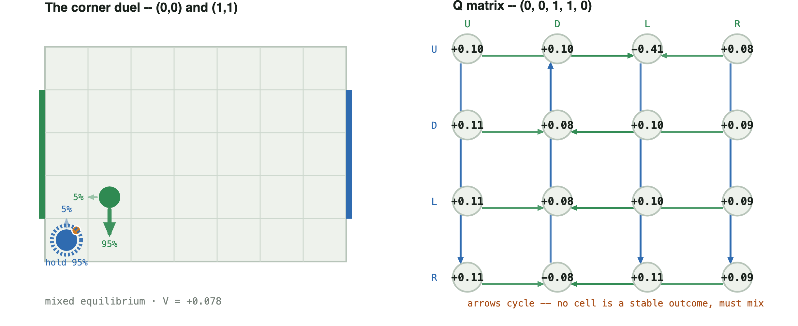

```
        U        D        L        R
  U   0.103    0.103   -0.408    0.084
  D   0.109    0.076    0.101    0.086
  L   0.109    0.076    0.101    0.086
  R   0.112   -0.075    0.112    0.088
```

**Successor states, by joint action** -- same orientation as the Q matrix above (`carrier` row, `defender` column), each cell the resulting `(x0, y0, x1, y1, b)`. Two lines in a cell means the outcome depends on who moves first (each 50%).

| carrier \ defender | U | D | L | R |
|---|---|---|---|---|
| **U** | (0,1,1,2,0) | (0,1,1,0,0) | 50%: (0,1,1,1,0)<br>50%: (0,0,0,1,1) | (0,1,2,1,0) |
| **D** | (0,0,1,2,0) | (0,0,1,0,0) | (0,0,0,1,0) | (0,0,2,1,0) |
| **L** | (0,0,1,2,0) | (0,0,1,0,0) | (0,0,0,1,0) | (0,0,2,1,0) |
| **R** | (1,0,1,2,0) | 50%: (1,0,1,1,0)<br>50%: (0,0,1,0,1) | (1,0,0,1,0) | (1,0,2,1,0) |

## Case 5 — `(0, 0, 2, 0, 0)`: a genuine 3-action mix

Six cells from goal, as far as this board allows, with the defender close
enough to threaten three different rows at once: no single row is safely
better than the other two, so three actions are simultaneously undominated
on both sides. This is one of only **4 states on the whole canonical board**
with support shape `(3,3)` -- mixing is not always a 50/50 split between two
actions. (Entropy 1.109 bits, the richest mix on this page, if a single
summary number is wanted -- but the three-way split itself is the point.)

**Both players are pinned against an edge here**, so read the raw action
letters with that in mind: the carrier sits at `(0, 0)`, so `L` is a wall
no-op -- it clamps straight back to `(0, 0)`, physically identical to `D` --
which is why the board figure draws that 54.7% as a dashed **hold** ring,
not a leftward arrow. The three genuinely distinct carrier choices are
*attack up* (`U`, 43.3%), *hold ground* (`D`/`L` combined, 54.7%), and
*sneak right* (`R`, 1.9%) -- still a real three-way mix, just not the
three-arrows picture the raw letters would suggest. The defender at `(2, 0)`
has the same issue in miniature: `D` is its own wall no-op (5.9%, folded
into its own hold ring), alongside real moves `U` (91.9%) and `L` (2.3%).

**Type:** degenerate equilibrium face (carrier) -- see "why indifferent"
below: a fourth, unweighted carrier action ties the reported three-way split
exactly, so the printed 43.3%/0%/54.7%/1.9% is one point on a larger face,
not a forced ratio. Here that tie is not a coincidence of the LP: `D` and
`L` are the *same physical action* from `(0, 0)`, so `E[D]`=`E[L]` is a
mechanical certainty, not a numerical accident -- the LP's split of that
54.7% between the labels `D` and `L` is arbitrary, but the 43.3%/54.7%/1.9%
split between *attack*/*hold*/*sneak* is not. The defender's own reported
split is a genuine forced mix.

**Support:** carrier `{U, L, R}` (43.3% / 54.7% / 1.9%, `L` a wall hold) ·
defender `{U, D, L}` (91.9% / 5.9% / 2.3%, `D` a wall hold).

**Why indifferent:** Carrier `E[U]`=`E[L]`=`E[R]`=+0.0848 (the three actions weighted) -- and `E[D]`=+0.0848 too: **all four actions tie exactly**, and `E[D]`=`E[L]` here is guaranteed before any LP runs, since `D` and `L` are the same wall-clamped no-op from `(0, 0)`. The printed 43.3%/0%/54.7%/1.9% split is one point on a whole face of equally-good carrier mixes, not a uniquely forced ratio. Defender `E[U]`=`E[D]`=`E[L]`=+0.0848, below `E[R]`=+0.097.


```
        U        D        L        R
  U   0.084    0.095    0.103    0.110
  D   0.086    0.076    0.076    0.086
  L   0.086    0.076    0.076    0.086
  R   0.088    0.095   -0.088    0.110
```

**Successor states, by joint action** -- same orientation as the Q matrix above (`carrier` row, `defender` column), each cell the resulting `(x0, y0, x1, y1, b)`. Two lines in a cell means the outcome depends on who moves first (each 50%).

| carrier \ defender | U | D | L | R |
|---|---|---|---|---|
| **U** | (0,1,2,1,0) | (0,1,2,0,0) | (0,1,1,0,0) | (0,1,3,0,0) |
| **D** | (0,0,2,1,0) | (0,0,2,0,0) | (0,0,1,0,0) | (0,0,3,0,0) |
| **L** | (0,0,2,1,0) | (0,0,2,0,0) | (0,0,1,0,0) | (0,0,3,0,0) |
| **R** | (1,0,2,1,0) | (1,0,2,0,0) | 50%: (1,0,2,0,0)<br>50%: (0,0,1,0,1) | (1,0,3,0,0) |

## Case 6 — `(1, 1, 2, 0, 1)`: a near-pure hedge, where rounding would lie

Gap `0.0043`. The **defender** plays `R 97.5% / D 2.5%` -- entropy only
0.169 bits, a hedge so lopsided that reading `0.975` as `1.0` would be a
real rounding mistake: the gap is certified and real, twelve times smaller
than a 0.1 rounding grid would resolve. The carrier's own mix is more
balanced (`D 73.9% / L 26.1%`) -- it is the defender's near-pure hedge that
makes this case worth including, not the carrier's. Read the carrier's `D`
with the board in mind: the carrier sits at `(2, 0)`, the bottom row, so
`D` is a wall no-op -- 73.9% of the time it **holds position** rather than
moving down, and the other 26.1% it slides left (`L`). Unlike Case 4 or 5,
this tie is a genuine strategic indifference between two *different*
physical options (hold vs. move), not two labels for the same action.

**Type:** forced mixed equilibrium -- lopsided, but neither side has a tied
outsider action.

**Support:** carrier `{hold, L}` (73.9% / 26.1%, printed as `D`/`L`) ·
defender `{D, R}` (2.5% / 97.5%, both real moves).

**Why indifferent:** Carrier `E[D]`=`E[L]`=+0.168, above `E[R]`=+0.136 and `E[U]`=−0.166 -- `D` here is the carrier holding its position at the bottom edge, genuinely tied with a real move left. Defender `E[D]`=`E[R]`=+0.168, below `E[L]`=+0.197 and `E[U]`=+0.201.

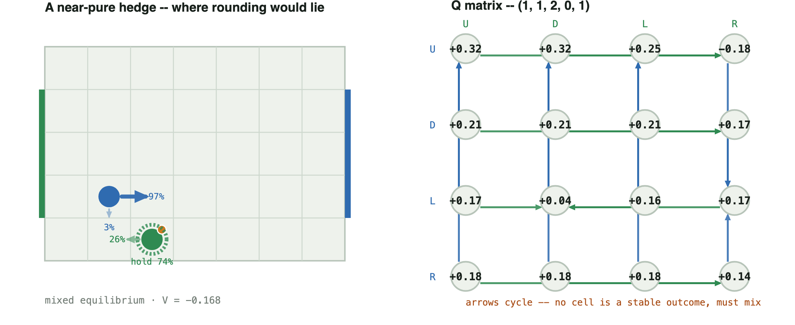

```
        U        D        L        R
  U   0.317    0.317    0.247   -0.178
  D   0.211    0.211    0.211    0.167
  L   0.171    0.045    0.157    0.171
  R   0.182    0.182    0.182    0.135
```

**Successor states, by joint action** -- same orientation as the Q matrix above (`carrier` row, `defender` column), each cell the resulting `(x0, y0, x1, y1, b)`. Two lines in a cell means the outcome depends on who moves first (each 50%).

| carrier \ defender | U | D | L | R |
|---|---|---|---|---|
| **U** | (1,2,2,1,1) | (1,0,2,1,1) | (0,1,2,1,1) | 50%: (2,1,2,0,0)<br>50%: (1,1,2,1,1) |
| **D** | (1,2,2,0,1) | (1,0,2,0,1) | (0,1,2,0,1) | (2,1,2,0,1) |
| **L** | (1,2,1,0,1) | 50%: (1,0,2,0,0)<br>50%: (1,1,1,0,1) | (0,1,1,0,1) | (2,1,1,0,1) |
| **R** | (1,2,3,0,1) | (1,0,3,0,1) | (0,1,3,0,1) | (2,1,3,0,1) |

## Case 7 — `(5, 1, 6, 1, 1)`: the typical mix, mirrored

`soccer_nash.symmetry.mirror_state` flips the board left-right and swaps
which player carries; this is Case 2's exact image under that map. The
values negate to machine precision:

    V(case 2) = +0.094235
    V(mirror) = -0.094235
    sum       = -1.39e-17   (zero, to floating-point noise)

Direct evidence for the repetition claim above: this is not a new shape, it
is Case 2's identical mix reappearing, exactly mirrored, wherever the same
relative configuration recurs on the board.

**Type:** forced mixed equilibrium -- Case 2's exact classification,
mirrored.

**Support:** carrier `{U, D}` (63.5% / 36.5%) · defender `{U, L}`
(36.5% / 63.5%).

**Why indifferent:** Carrier `E[U]`=`E[D]`=+0.094, above `E[R]`=+0.091 and `E[L]`=−0.015. Defender `E[U]`=`E[L]`=+0.094, below `E[R]`=+0.212 and `E[D]`=+0.332 -- Case 2's exact chain, mirrored.

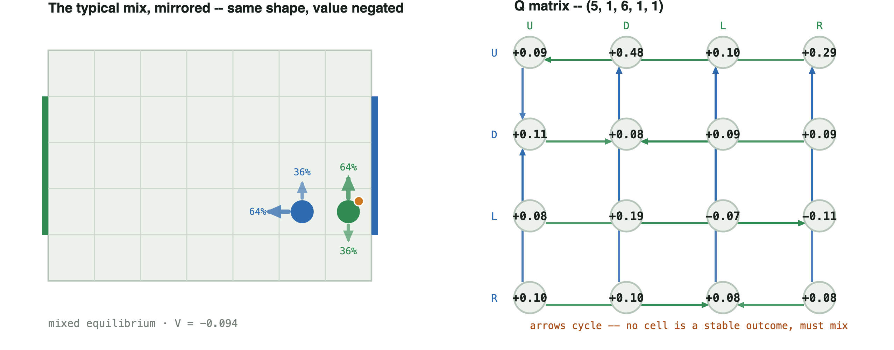

```
        U        D        L        R
  U   0.086    0.478    0.099    0.286
  D   0.109    0.076    0.086    0.085
  L   0.082    0.187   -0.071   -0.108
  R   0.103    0.103    0.084    0.085
```

**Successor states, by joint action** -- same orientation as the Q matrix above (`carrier` row, `defender` column), each cell the resulting `(x0, y0, x1, y1, b)`. Two lines in a cell means the outcome depends on who moves first (each 50%).

| carrier \ defender | U | D | L | R |
|---|---|---|---|---|
| **U** | (5,2,6,2,1) | (5,0,6,2,1) | (4,1,6,2,1) | 50%: (5,1,6,2,1)<br>50%: (6,1,6,2,1) |
| **D** | (5,2,6,0,1) | (5,0,6,0,1) | (4,1,6,0,1) | 50%: (5,1,6,0,1)<br>50%: (6,1,6,0,1) |
| **L** | 50%: (5,2,5,1,1)<br>50%: (5,2,6,1,0) | 50%: (5,0,5,1,1)<br>50%: (5,0,6,1,0) | 50%: (4,1,5,1,1)<br>50%: (4,1,6,1,0) | 50%: (5,1,6,1,0)<br>50%: (5,1,6,1,1) |
| **R** | (5,2,6,1,1) | (5,0,6,1,1) | (4,1,6,1,1) | (5,1,6,1,1) |

## Case 8 — `(2, 3, 3, 3, 1)`, on a 5×4 board: this project's own tackle rule

Every other case here gets its coin flip from Littman's random move order.
This one is solved under [the tackle rule](tackle.md)
(`move_order="tackle", tackle_prob=0.5`) instead -- the defender commits to a
challenge that wins the ball with some fixed probability or bounces off, a
mechanism with nothing to do with move order at all. It produces the same
kind of duel (gap 0.0223): the carrier mixes `U 32.1% / D 67.9%`, the
defender mixes `D 60.7% / R 39.3%`. Different cause, same structure. The
carrier sits at `(3, 3)`, the top row of this 5x4 board, so `U` is a wall
no-op: 32.1% of the time it holds its ground rather than pushing up, and
67.9% of the time it drives down (`D`), a real move.

**Type:** forced mixed equilibrium -- same classification as the
move-order-driven cases above, under a completely different mechanism.

**Support:** carrier `{hold, D}` (32.1% / 67.9%, printed as `U`/`D`) ·
defender `{D, R}` (60.7% / 39.3%, both real moves).

**Why indifferent:** Carrier `E[U]`=`E[D]`=−0.013, above `E[R]`=−0.031 and `E[L]`=−0.065 -- `U` here is the carrier holding at the top edge, genuinely tied with a real move down. Defender `E[D]`=`E[R]`=−0.013, below `E[L]`=+0.011 and `E[U]`=+0.045.

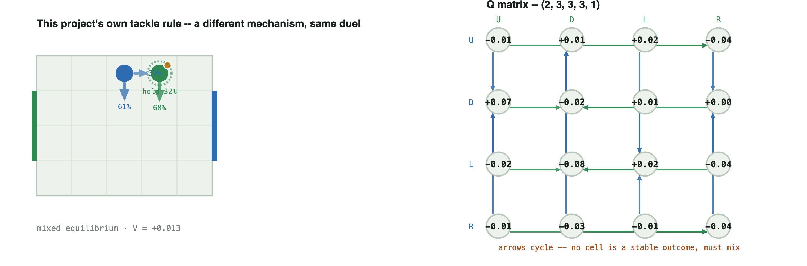

```
        U        D        L        R
  U  -0.012    0.005    0.016   -0.042
  D   0.072   -0.022    0.009    0.000
  L  -0.019   -0.080    0.019   -0.042
  R  -0.007   -0.026   -0.006   -0.039
```

**Successor states, by joint action** -- same orientation as the Q matrix above (`carrier` row, `defender` column), each cell the resulting `(x0, y0, x1, y1, b)`. Two lines in a cell means the outcome depends on who moves first (each 50%).

| carrier \ defender | U | D | L | R |
|---|---|---|---|---|
| **U** | (2,3,3,3,1) | (2,2,3,3,1) | (1,3,3,3,1) | 50%: (3,3,4,3,0)<br>50%: (2,3,3,3,1) |
| **D** | (2,3,3,2,1) | (2,2,3,2,1) | (1,3,3,2,1) | 50%: (3,3,4,3,0)<br>50%: (2,3,3,2,1) |
| **L** | (2,3,3,3,0) | (2,2,2,3,1) | (1,3,2,3,1) | 50%: (3,3,4,3,0)<br>50%: (2,3,3,3,1) |
| **R** | (2,3,4,3,1) | (2,2,4,3,1) | (1,3,4,3,1) | 50%: (3,3,4,3,0)<br>50%: (2,3,4,3,1) |

## Case 9 — `(0, 2, 1, 2, 0)`: the asymmetric mix -- the sharpest LP-degeneracy example

Support `(2, 1)` -- gap `0.0095`. The odd one out: the carrier's equilibrium
still mixes two actions (`U 2.6% / D 97.4%`), but the **defender's**
equilibrium is a *single fixed move* (`R`, 100%). Every other case on this
page is a symmetric duel -- both players genuinely guessing. Here only one
side is.

**Type:** pure-tied / fractional LP output (defender). The defender's
official policy is printed pure `R` (100%), but `D` ties it exactly -- the
defender's choice of `R` over `D` is exactly as arbitrary as a printed
fractional split, it just isn't drawn as a percentage because the LP put
all the weight on one action. This is the sharpest example on this page
that **a fractional LP output is not automatically a strategically required
mixed strategy.**

**Support:** carrier `{U, D}` (2.6% / 97.4%) · defender `{R}` (100%).

**Why indifferent:** Carrier `E[U]`=`E[D]`=+0.095, above `E[L]`=+0.093 and `E[R]`=−0.072 (worked out fully below). The defender's official policy is pure `R` (100%), but `E[R]`=+0.095 and `E[D]`=+0.095 tie **too**: the defender's own choice of `R` over `D` is exactly as arbitrary as the carrier's `U`/`D` split, it just isn't printed as a percentage because the solver put all the weight on one side.


```
        U        D        L        R
  U   0.085    0.478    0.291    0.095
  D   0.478    0.085    0.291    0.095
  L   0.093    0.093    0.086    0.093
  R   0.082    0.082   -0.122   -0.072
```

**Successor states, by joint action** -- same orientation as the Q matrix above (`carrier` row, `defender` column), each cell the resulting `(x0, y0, x1, y1, b)`. Two lines in a cell means the outcome depends on who moves first (each 50%).

| carrier \ defender | U | D | L | R |
|---|---|---|---|---|
| **U** | (0,3,1,3,0) | (0,3,1,1,0) | 50%: (0,3,0,2,0)<br>50%: (0,3,1,2,0) | (0,3,2,2,0) |
| **D** | (0,1,1,3,0) | (0,1,1,1,0) | 50%: (0,1,0,2,0)<br>50%: (0,1,1,2,0) | (0,1,2,2,0) |
| **L** | (0,2,1,3,0) | (0,2,1,1,0) | (0,2,1,2,0) | (0,2,2,2,0) |
| **R** | 50%: (0,2,1,3,1)<br>50%: (1,2,1,3,0) | 50%: (0,2,1,1,1)<br>50%: (1,2,1,1,0) | 50%: (0,2,1,2,0)<br>50%: (0,2,1,2,1) | 50%: (0,2,2,2,1)<br>50%: (1,2,2,2,0) |

Why the carrier still needs two actions against a defender who never
varies: against the defender's pure `R`, column `R` reads `U 0.095, D 0.095,
L 0.093, R -0.072` -- **`U` and `D` are exactly tied**, both strictly better
than `L` or `R`. Nothing in the payoffs favours one over the other, so any
split of `U`/`D` is an equally valid best reply; the solver's LP reports one
particular split (`2.6% / 97.4%`), not a probability forced by the game the
way Case 3's `7.7% / 92.3%` is. `soccer_nash/certificate.py`'s `gap` field
still distinguishes the two: a tie is a **degenerate** saddle (row `L`'s pure
security value, `0.086`, sits within `0.0095` of the mixed value), while
Case 3's cycle has no pure security value anywhere near it.

## Case 10 — `(0, 2, 2, 2, 1)`: the three-lane mix

Support `(3, 2)` -- gap `0.0699`, the **deepest gap of any state on this
page** (fifteen times deeper than the shallowest hedge in Case 6). This is
the fourth and last canonical support shape: the carrier genuinely needs
three live actions, while the defender only ever needs two. Combined with
Case 9, this settles a structural question the certificates make checkable
rather than assumed: **the defender never needs strictly more actions than
the carrier**, across all 94 no-pure-saddle states on the canonical board.
The defender sits at `(0, 2)`, the left edge, so its reported majority
action `L` (77.9%) is a wall no-op -- it holds position rather than moving
left; the genuine move in its support is `R` (22.1%).

**Type:** degenerate equilibrium face (defender) -- see "why indifferent"
below: `D` ties the reported `{L, R}` split exactly, so the defender is
really indifferent among three actions even though the LP only split weight
over two of them -- and one of those two, `L`, is itself the wall-clamped
hold, not a real move. The carrier's own reported three-way split is a
genuine forced mix.

**Support:** carrier `{U, D, L}` (16.9% / 66% / 17.1%) · defender
`{hold, R}` (77.9% / 22.1%, printed as `L`/`R`).

**Why indifferent:** Carrier `E[U]`=`E[D]`=`E[L]`=+0.282, above `E[R]`=+0.217 -- a genuine three-way tie. The defender's official support is `{L, R}` at +0.282, below `E[U]`=+0.322 -- but `E[D]`=+0.282 too: the defender is really indifferent among *holding* (`L`), moving down (`D`), and moving right (`R`), even though the LP only split weight over two of them.

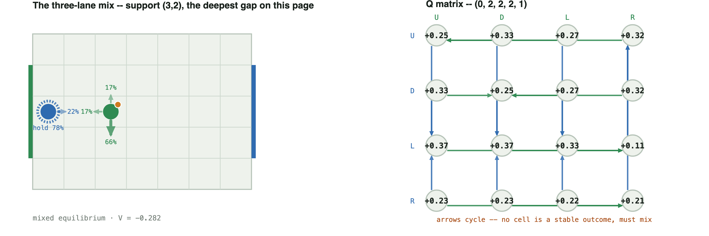

```
        U        D        L        R
  U   0.247    0.330    0.272    0.317
  D   0.330    0.247    0.272    0.317
  L   0.366    0.366    0.330    0.110
  R   0.228    0.228    0.220    0.205
```

**Successor states, by joint action** -- same orientation as the Q matrix above (`carrier` row, `defender` column), each cell the resulting `(x0, y0, x1, y1, b)`. Two lines in a cell means the outcome depends on who moves first (each 50%).

| carrier \ defender | U | D | L | R |
|---|---|---|---|---|
| **U** | (0,3,2,3,1) | (0,1,2,3,1) | (0,2,2,3,1) | (1,2,2,3,1) |
| **D** | (0,3,2,1,1) | (0,1,2,1,1) | (0,2,2,1,1) | (1,2,2,1,1) |
| **L** | (0,3,1,2,1) | (0,1,1,2,1) | (0,2,1,2,1) | 50%: (1,2,2,2,0)<br>50%: (0,2,1,2,1) |
| **R** | (0,3,3,2,1) | (0,1,3,2,1) | (0,2,3,2,1) | (1,2,3,2,1) |

## Case 11 — `(4, 4, 5, 4, 0)`, deterministic: mixing forced by reward alone, not transition

An advanced case, illustrating a fundamentally different mechanism from the
four above. Every case so far gets its coin flip from a stochastic
*transition* -- the random move order. This one has **no transition
stochasticity at all** (`move_order="deterministic"`): the mix comes
entirely from `scoring="territory"`, a dense per-step reward for the ball
in the opponent's final third, layered on top of the ordinary win/loss
score. Gap `0.0653` -- close to a fair coin (entropy 0.996 bits), forced
purely by coupling the reward to both players' actions. **Mixing does not
require stochastic transitions; it can come from the payoff structure
alone.** The defender sits at `(5, 4)`, the top edge, so its reported
majority action `U` (95.1%) is a wall no-op: it holds position 95.1% of the
time and slides left (`L`) the other 4.9%.

**Type:** forced mixed equilibrium -- the reward-coupling forces a genuine
indifference on both sides, the same as a transition-coupled matching-pennies
core.

**Support:** carrier `{D, R}` (53.8% / 46.2%, both real moves) · defender
`{hold, L}` (95.1% / 4.9%, printed as `U`/`L`).

**Why indifferent:** Carrier `E[D]`=`E[R]`=+0.129, above `E[U]`=+0.119 and `E[L]`=+0.090. Defender `E[U]`=`E[L]`=+0.129, below `E[D]`=+0.455 and `E[R]`=+0.473 -- `U` here is the defender holding at the top edge, tied with a real move left.


```
        U        D        L        R
  U   0.116    0.105    0.170    0.136
  D   0.094    0.415    0.815    0.450
  L   0.094    0.105    0.000    0.105
  R   0.170    0.500   -0.671    0.500
```

**Successor states, by joint action** -- same orientation as the Q matrix above (`carrier` row, `defender` column), each cell the resulting `(x0, y0, x1, y1, b)`. Two lines in a cell means the outcome depends on who moves first (each 50%).

| carrier \ defender | U | D | L | R |
|---|---|---|---|---|
| **U** | (4,4,5,4,0) | (4,4,5,3,0) | (4,4,5,4,1) | (4,4,6,4,0) |
| **D** | (4,3,5,4,0) | (4,3,5,3,0) | (4,3,4,4,0) | (4,3,6,4,0) |
| **L** | (3,4,5,4,0) | (3,4,5,3,0) | (3,4,4,4,0) | (3,4,6,4,0) |
| **R** | (4,4,5,4,1) | (5,4,5,3,0) | (5,4,4,4,1) | (5,4,6,4,0) |

## Case 12 — `(1, 3, 1, 4, 1)`: movement slip on a single-cell goal

The sharpest possible contrast with Case 1. A single-cell goal under
deterministic move order is **pure across every configuration tested in
this project** -- that is [the whole goal-width result](result.md); a
board-size-free proof remains open (see [generalize.md](generalize.md)).
Add `slip=0.15` (each player independently takes a uniform-random move
instead of its chosen one, 15% of the time, regardless of position) to that
exact board, and **52 mixed states appear** where there were 0. Gap `0.0172`
-- a genuine, certified mix, not noise. [generalize.md](generalize.md)
states the mechanism precisely: the goal-width switch is a property of
Littman's move-order coin specifically; a coin that lands on every square
regardless of the goal forces mixing everywhere, independent of goal width.

**Type:** forced mixed equilibrium -- movement noise produces the same
genuine indifference as the move-order coin, on a board shape that is
otherwise always pure.

**Support:** carrier `{D, L}` (80.2% / 19.8%) · defender `{U, L}`
(3.9% / 96.1%).

**Why indifferent:** Carrier `E[D]`=`E[L]`=+0.053, above `E[R]`=+0.016 and `E[U]`=−0.010. Defender `E[U]`=`E[L]`=+0.053, below `E[D]`=+0.072 and `E[R]`=+0.450.

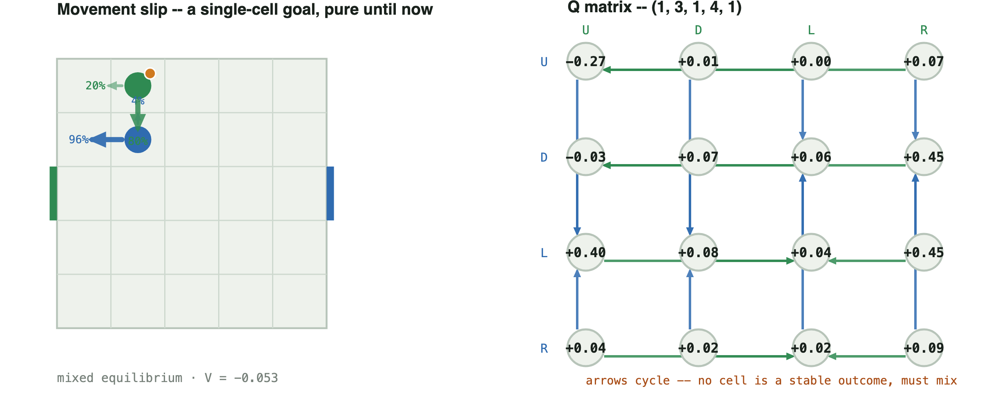

```
        U        D        L        R
  U  -0.273    0.006    0.001    0.069
  D  -0.031    0.069    0.057    0.450
  L   0.396    0.083    0.039    0.450
  R   0.039    0.020    0.015    0.092
```

**Successor states, by joint action** -- same orientation as the Q matrix above (`carrier` row, `defender` column), each cell the resulting `(x0, y0, x1, y1, b)`. Two lines in a cell means the outcome depends on who moves first (each 50%).

*Shown: the intended successor before movement slip is applied (`slip=0` isolates it, for readability). The actual game has `slip=0.15`; running `python scripts/positions.py` on this state prints the full noisy distribution -- up to 16 outcomes per cell, each intended move landing on its target around 79% of the time and spreading over nearby cells the rest. See [generalize.md](generalize.md).*

| carrier \ defender | U | D | L | R |
|---|---|---|---|---|
| **U** | (1,3,1,4,0) | (1,2,1,4,1) | (0,3,1,4,1) | (2,3,1,4,1) |
| **D** | (1,4,1,3,0) | (1,2,1,3,1) | (0,3,1,3,1) | (2,3,1,3,1) |
| **L** | (1,4,0,4,1) | (1,2,0,4,1) | (0,3,0,4,1) | (2,3,0,4,1) |
| **R** | (1,4,2,4,1) | (1,2,2,4,1) | (0,3,2,4,1) | (2,3,2,4,1) |

## The mathematics behind all twelve

A mixed equilibrium is exactly the strategy pair where every action in a
player's support earns the **same expected payoff** against the opponent's
own mix -- that equality is what "indifferent" means in Case 3, and it is
also why the best-response graph above cycles with no resting point: if one
action in the support paid strictly more, that player would raise its weight
on it, which is precisely the condition an equilibrium rules out. A
best-reply cycle and mutual indifference are the same fact seen from two
sides, not two different explanations ([numerics.md](numerics.md) §0). Case 9
shows the boundary of that story: indifference alone (a tie against a fixed
opponent) can produce the same *symptom* -- a fractional policy -- without a
cycle anywhere in the matrix.

## Reproduction

`python scripts/positions.py` prints the exact `4x4` Q matrix, policy,
action support, and the successor-state coordinate table for all twelve
states, and writes
`figures/gallery/positions.svg`. A PDF write-up of this page is at
[positions.pdf](positions.pdf). `python scripts/pure_vs_mixed_exploit.py`
reproduces the pure-vs-mixed exploitability table above. `python
scripts/degeneracy.py` reproduces the forced/degenerate/pure-tied
classification behind every "Type" label above.
